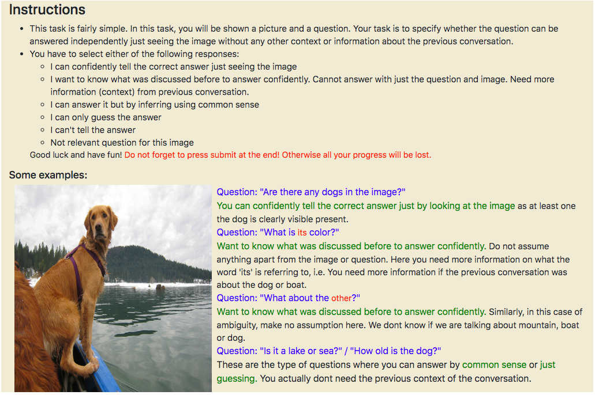
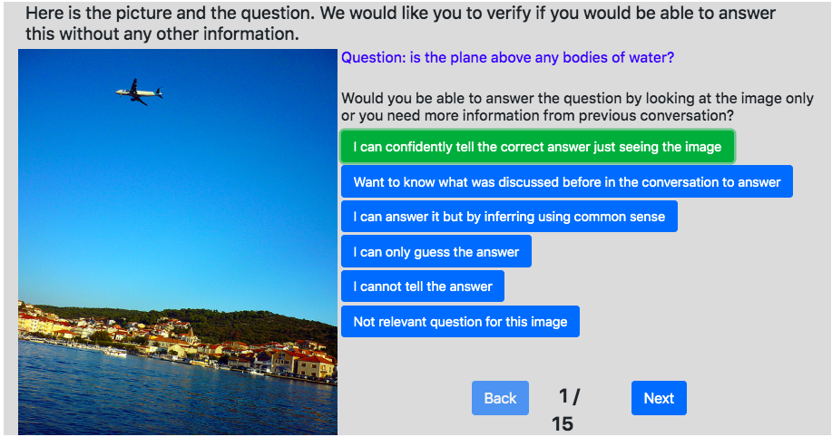
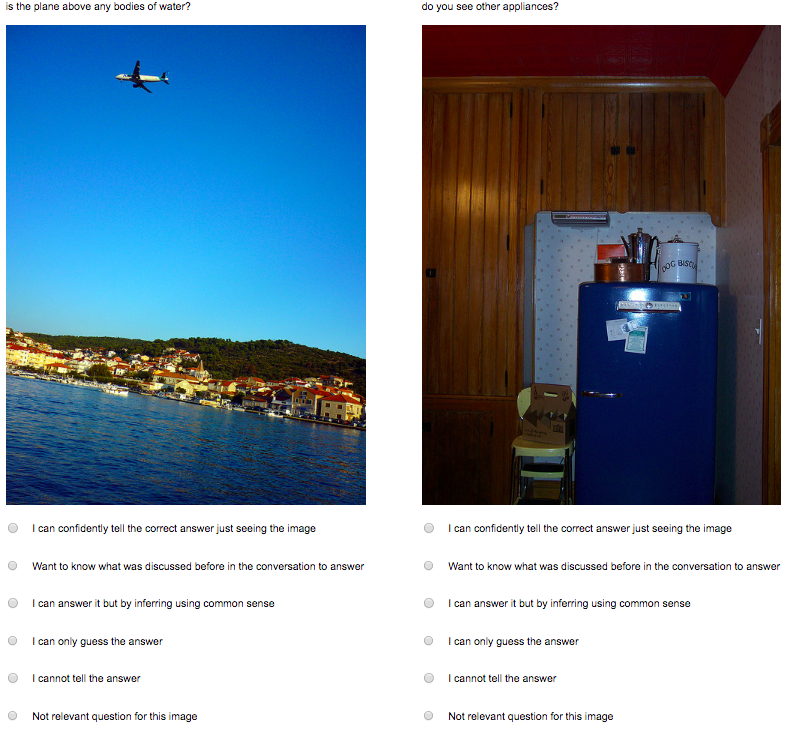

## visdialconv-amt

This repository contains code used for data collection on AMT in our ACL'20 paper `History for Visual Dialog: Do we really need it?`

These are the set of instructions that were provided to the crowdturkers.


Task for the crowdworkers looked like:


We also setup a qualification test for the users before they can even attempt the task. 



## Credits

This repository is build upon [simple-amt](https://github.com/jcjohnson/simple-amt). Previous commit history is maintained. 

## Code
We recommend to follow `original_README.md` or go to the [simple-amt](https://github.com/jcjohnson/simple-amt) page to understand the essentials and set up the conda/virtualenv Python environment.

```
conda create --name visdialconv_amt python=3 -y
eval "$(conda shell.bash hook)"
conda activate visdialconv_amt

pip install -r requirements.txt
```

Most of the code specific to our task resides in [visdial_task](./visdial_task) folder while we follow the same boilerplate code provided by simple-amt. Thanks to @jcjohnson. Copy/edit the code in this folder according to your task. 

For a quick look into templates, see [visdial_task/hit_templates](./visdial_task/hit_templates)

As mentioned in our paper, we used Qualification tests to filter out crowdworkers. See qualification questions and answers in [visdial_task/hit_templates] 

We prepared shell scripts for launching/rendering/deleting in [visdial_task/answerable_task](./visdial_task/answerable_task). Have a look at the original README if you have limited experience with the shell scripts. Be careful of `--prod` flag to launch on AMT with actual money.

Example to launch hits using the shell script: 

```
cd visdial_task/answerable_task
bash launch_hits.sh
```

## Citation

If you use this work, please cite it as
```
@inproceedings{agarwal2020history,
  title={History for Visual Dialog: Do we really need it?},
  author={Agarwal, Shubham and Bui, Trung and Lee, Joon-Young and Konstas, Ioannis and Rieser, Verena},
  booktitle={58th Annual meeting of the Association for Computational Linguistics (ACL)},
  year={2020}
}
```

Feel free to fork and contribute to this work. Please raise a PR or any related issues. Will be happy to help. Thanks.


